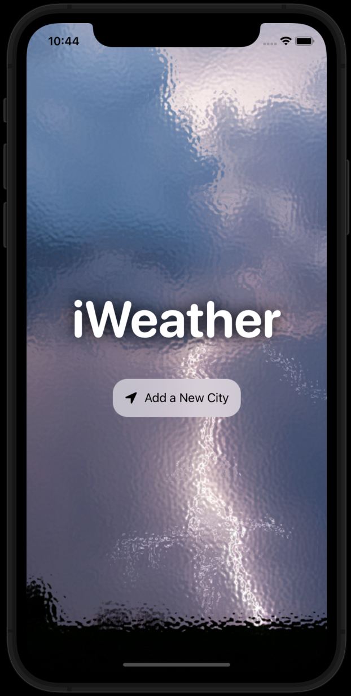

# iWeather

Hi there! This is my new attempt of using SwiftUI to develop a weather application. It is just a simple application created while getting used to this new framework. iWeather allows you to know the weather in different locations at the same time using metric units so far. The develpment of this app was a great chance to get familiar with the architectural pattern Model-View-ViewModel (MVVM). Unlikely UIKit and the storyboard way of build apps, SwiftUI is aimed to take advantage of MVVM pattern to avoid having huge controllers files full of methods.

