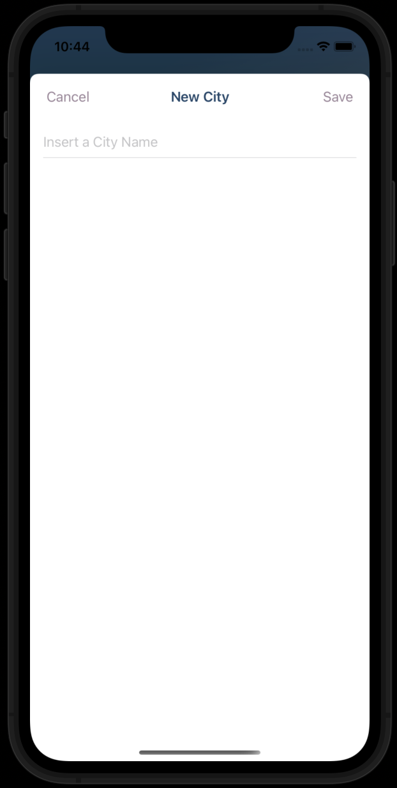
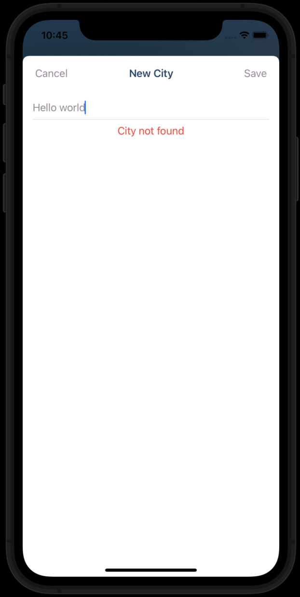
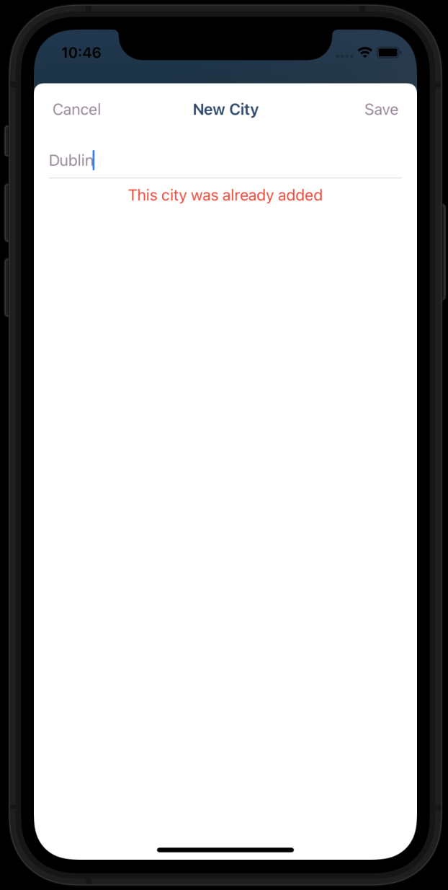
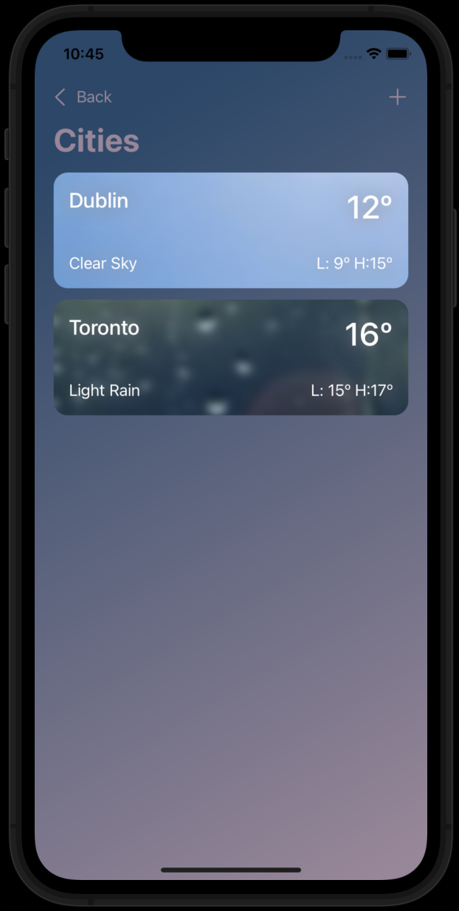
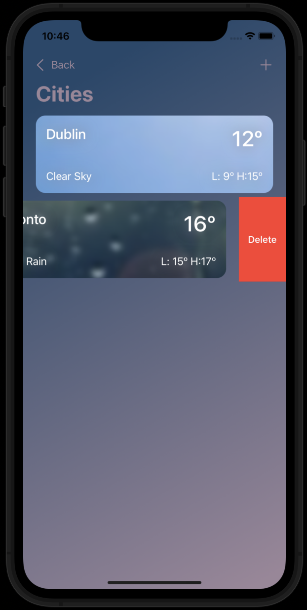
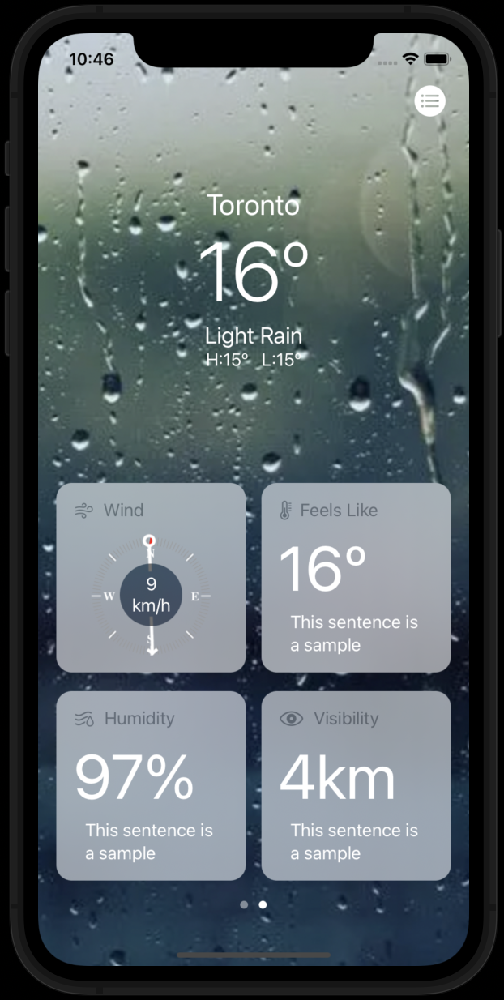

# iWeather

Hi there 🙋🏻‍♂️! This is my very first attempt of using SwiftUI 🍎 to develop a weather application 🌤. It is just a simple one created while getting used to this new framework. The develpment of this app was also a great chance to get familiar with the architectural pattern Model-View-ViewModel (MVVM)👷🏻‍♂️, which among other benefits avoids ending up to have oversized controllers dealing with models and views.

iWeather allows you to know the weather in different locations at the same time using metric units so far. All those locations are stored in our device using UserDefaults, as they are just a little piece of information. This way, everysingle time the user accesses to iWeather, the app loads this locations updating their weather.

###### Main Screen

The first time running the app we will not have any location stored on our device so we will have the possibility to get access to that screen by tapping on the button.

###### Adding a new city screen

This version of the app only allows us to access to the cities by its names but it is clearly something to improve in following versions.

###### City not found error

When attempting to enter a city does not exist, the user get a error message not being able to continue the process of adding a new city

###### City already exits error

The same thing happens when trying to enter a city that already does already exist. Althought the error message is different.

###### List of cities

All the cities selected are visualized on this list.

###### Deleting city from list

Deleting a city from the list is just a matter of swiping left.

###### Weather information

Some basic information is showed. The backgroun image dinamically matches the weather information for that city.

## Skills

1. **MVVM Pattern**: to struct the application decoupling views from models and avoiding oversized controllers.
2. **UserDefaulf**: as a way to pesist city information on our devices.
3. **ObservableObject protocol**: to allow information to go from one part of the app to another updating the views as fast as any of the object property is modified.
4. **Codable protocol**: which makes coding and decoding the information coming from the wehather API be almost automatic.

## To improve
1. Let the user set their information units.
2. Let the user choose the city to a certain country.
3. Implement the class WeatherManager, class in charge of loading, updating and managing the information, as a Singleton that can be accessed from any ViewModel.
4. In case we have not entered any city, allowing the app to get the user's location weather.
5. Check the views to make them suitable to all iPhones.

